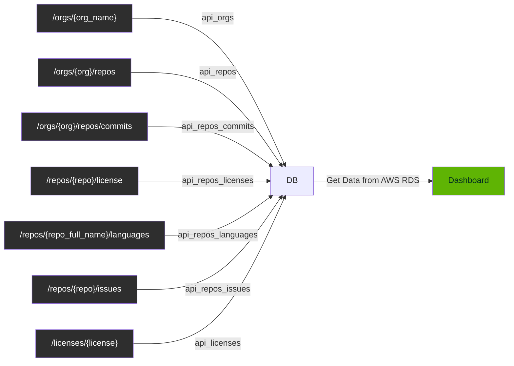

# Opensource tracker

[GitHub REST API](https://docs.github.com/ko/rest?apiVersion=v3)를 활용하여 국내 기업의 오픈소스 현황을 대시보드로 보여줍니다.

## Team

- 프로그래머스 데이터엔지니어링 데브코스 1기
- 2차 프로젝트 1팀 1조
- 기간: 2023. 05. 29. (월) ~ 06. 02. (금)

| **김민석** | **서대원** | **안수빈** | **이수영** | **정희원** |
|:---:|:---:|:---:|:---:|:---:|
|  |  |  |  |  |


## Result of This Project

> ⭐ 대시보드에서 Organization과 Repository 이름에 대한 필터를 걸 수 있습니다.

### 1. For all organizations


### 2. For each organization


### 3. For each repository


## Tech Stack

| Field | Stack |
|:---:|:---|
| Language |  |
| Data Base |    |
| Dashboard |  |
| Cron-job |  |


## Usage

```bash
# venv 활성화
$ . .venv/bin/activate

# 의존성 설치
$ pip install -r requirements.txt
```


## Structures

```
.
├── README.md
├── requirements.txt
├── .github/workflows/
├── collect_data/       데이터 수집을 위한 파이썬 코드
│  ├── collect_data.py
│  ├── api_calls/
│  └── playground/
└── sql/                SQL 정의
   ├── dcl/
   └── ddl_raw_data/
```


## How did we create the dashboard


